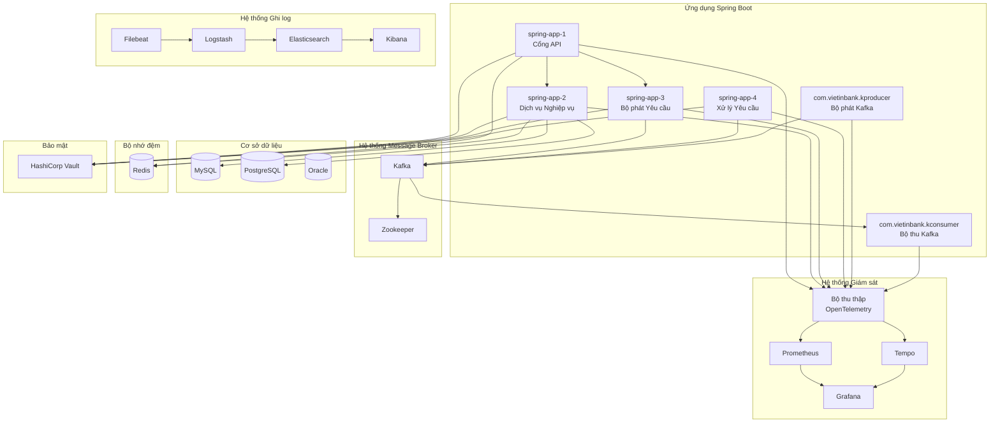
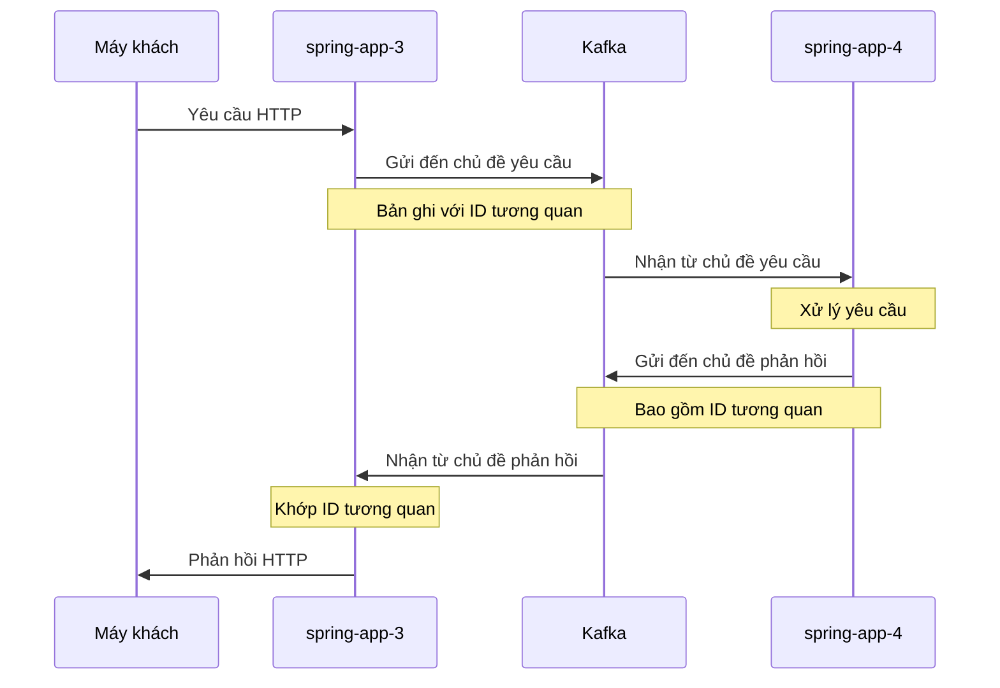
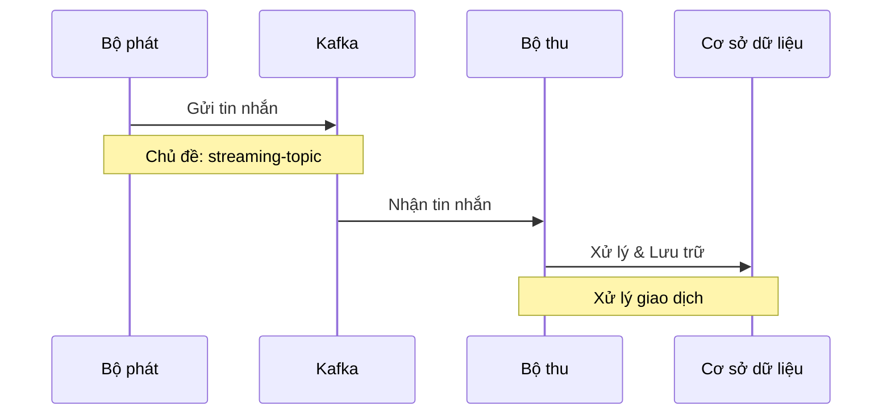
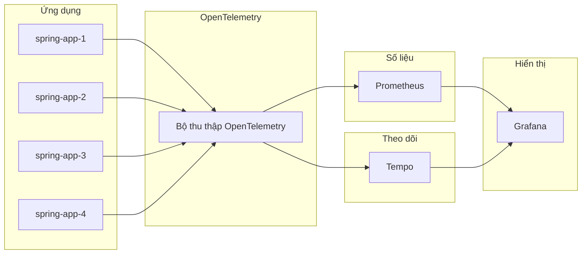
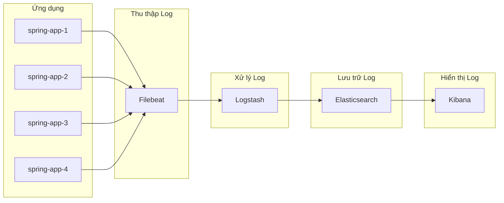
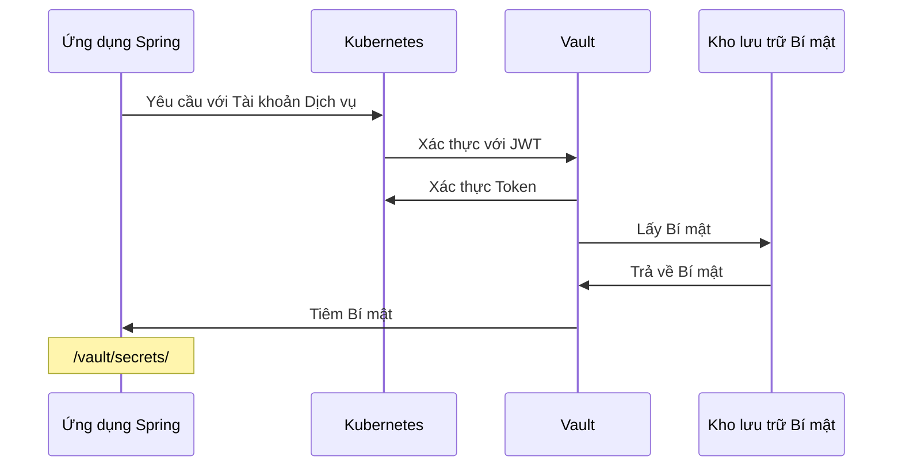
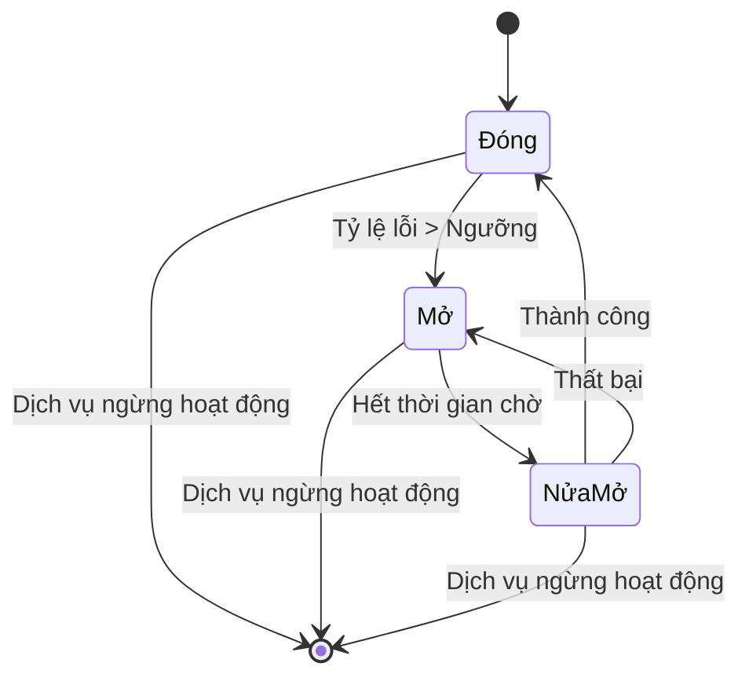

# Sơ đồ Luồng Dữ liệu và Tương tác Hệ thống

## 1. Tổng quan Kiến trúc Hệ thống

## 2. Luồng Yêu cầu/Phản hồi qua Kafka

## 3. Luồng Truyền Phát Tin nhắn

## 4. Luồng Giám sát Hệ thống

## 5. Luồng Ghi Log

## 6. Luồng Bảo mật với Vault

## 7. Luồng Ngắt Mạch Bảo vệ

